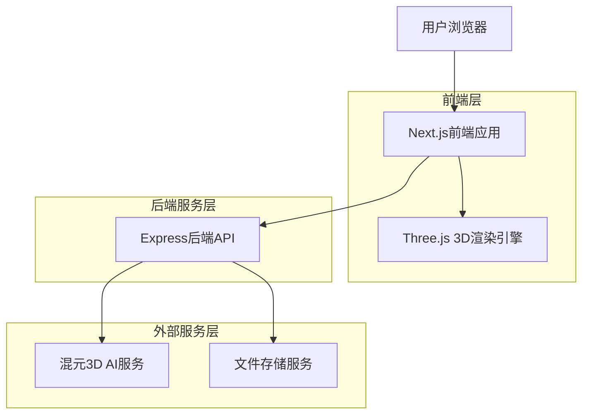

# 3D模型生成Web应用程序技术架构文档

## 1. 系统架构设计

### 1.1 整体架构



### 1.2 技术栈选择

#### 前端技术栈
- **Next.js 15**: 基于React的全栈框架，支持App Router和服务器组件
- **React Three Fiber**: React生态的Three.js封装，提供声明式3D编程
- **Three.js**: 业界标准的WebGL 3D图形库
- **Tailwind CSS**: 实用优先的CSS框架，快速构建响应式界面
- **Zustand**: 轻量级状态管理，替代Redux的复杂配置
- **TypeScript**: 类型安全的JavaScript超集

#### 后端技术栈
- **Express.js**: 轻量级Node.js Web框架
- **Multer**: 文件上传中间件
- **CORS**: 跨域资源共享处理
- **Helmet**: 安全HTTP头中间件
- **Compression**: 响应压缩优化

#### 3D技术栈
- **GLTF/GLB格式**: 3D资产标准格式，支持材质、动画等
- **Draco压缩**: 3D模型压缩算法，减少传输体积
- **WebGL**: 浏览器原生3D渲染API

## 2. 核心功能模块设计

### 2.1 输入处理模块

#### 图像上传组件
```typescript
interface ImageUploadProps {
  onImageSelect: (file: File) => void;
  maxSize?: number; // 默认10MB
  acceptedFormats?: string[]; // ['image/jpeg', 'image/png', 'image/webp']
}

// 功能特性
- 拖拽上传支持
- 文件类型验证
- 图像预览
- 上传进度显示
- 错误处理机制
```

#### 文本输入组件
```typescript
interface TextInputProps {
  maxLength?: number; // 默认500字符
  placeholder?: string;
  examples?: string[];
  onTextSubmit: (text: string) => void;
}

// 功能特性
- 实时字符计数
- 示例提示词展示
- 输入验证
- 多语言支持
```

### 2.2 3D渲染模块

#### Three.js场景管理器
```typescript
class Scene3DManager {
  private scene: THREE.Scene;
  private camera: THREE.PerspectiveCamera;
  private renderer: THREE.WebGLRenderer;
  private controls: OrbitControls;
  
  // 核心方法
  loadModel(url: string): Promise<THREE.Object3D>;
  updateLighting(config: LightingConfig): void;
  updateMaterial(material: MaterialConfig): void;
  exportModel(format: 'glb' | 'gltf'): Promise<Blob>;
}
```

#### React Three Fiber组件结构
```typescript
// 3D场景容器
function Scene3DContainer({ modelUrl, onLoad }: Scene3DProps) {
  return (
    <Canvas>
      <ambientLight intensity={0.5} />
      <directionalLight position={[10, 10, 5]} />
      <ModelViewer url={modelUrl} onLoad={onLoad} />
      <OrbitControls enablePan enableZoom enableRotate />
    </Canvas>
  );
}

// 模型加载器组件
function ModelViewer({ url, onLoad }: ModelViewerProps) {
  const { scene } = useGLTF(url);
  useEffect(() => {
    onLoad && onLoad(scene);
  }, [scene, onLoad]);
  
  return <primitive object={scene} />;
}
```

### 2.3 进度跟踪模块

#### 生成状态管理
```typescript
interface GenerationState {
  status: 'idle' | 'uploading' | 'processing' | 'generating' | 'completed' | 'error';
  progress: number; // 0-100
  estimatedTime: number; // 剩余时间(秒)
  errorMessage?: string;
  resultUrl?: string;
}

// 状态流转
const generationFlow = {
  idle: ['uploading'],
  uploading: ['processing', 'error'],
  processing: ['generating', 'error'],
  generating: ['completed', 'error'],
  completed: ['idle'],
  error: ['idle']
};
```

#### WebSocket实时通信
```typescript
// 进度更新协议
interface ProgressUpdate {
  taskId: string;
  status: GenerationState['status'];
  progress: number;
  message: string;
  timestamp: number;
}

// 客户端实现
class ProgressTracker {
  private ws: WebSocket;
  private subscribers: Map<string, (update: ProgressUpdate) => void>;
  
  subscribe(taskId: string, callback: (update: ProgressUpdate) => void): void;
  unsubscribe(taskId: string): void;
  connect(): Promise<void>;
  disconnect(): void;
}
```

### 2.4 用户交互模块

#### 3D控制面板
```typescript
interface ControlPanelProps {
  modelLoaded: boolean;
  onRotate: (axis: 'x' | 'y' | 'z', angle: number) => void;
  onScale: (factor: number) => void;
  onReset: () => void;
  onDownload: () => void;
  onShare: () => void;
}

// 控制功能
- 旋转控制(X/Y/Z轴)
- 缩放控制(0.1x - 10x)
- 重置视图
- 自动旋转
- 网格显示切换
- 线框模式切换
```

#### 分享功能
```typescript
interface ShareOptions {
  modelId: string;
  title: string;
  description: string;
  thumbnail?: string;
}

// 分享方式
- 直接链接分享
- 社交媒体分享(Twitter, Facebook)
- 嵌入代码生成
- QR码生成
```

## 3. API接口规范

### 3.1 认证接口

#### 用户注册/登录
```http
POST /api/auth/register
Content-Type: application/json

{
  "email": "user@example.com",
  "password": "secure_password",
  "name": "用户名"
}

Response:
{
  "success": true,
  "data": {
    "userId": "uuid",
    "token": "jwt_token",
    "refreshToken": "refresh_token"
  }
}
```

### 3.2 3D模型生成接口

#### 图像生成
```http
POST /api/generate/from-image
Content-Type: multipart/form-data
Authorization: Bearer {token}

Form Data:
- image: File (JPG/PNG/WEBP, max 10MB)
- options: JSON string {
    "style": "realistic|cartoon|low-poly",
    "quality": "standard|high",
    "format": "glb|gltf"
  }

Response:
{
  "success": true,
  "data": {
    "taskId": "task_uuid",
    "status": "processing",
    "estimatedTime": 300,
    "progressUrl": "/api/progress/{taskId}"
  }
}
```

#### 文本生成
```http
POST /api/generate/from-text
Content-Type: application/json
Authorization: Bearer {token}

{
  "prompt": "科幻风格机器人",
  "negativePrompt": "低质量, 模糊",
  "options": {
    "style": "realistic",
    "quality": "high",
    "format": "glb"
  }
}

Response:
{
  "success": true,
  "data": {
    "taskId": "task_uuid",
    "status": "processing",
    "estimatedTime": 240,
    "progressUrl": "/api/progress/{taskId}"
  }
}
```

### 3.3 进度查询接口

#### WebSocket连接
```javascript
// 连接URL
ws://localhost:3001/api/progress/{taskId}

// 消息格式
{
  "type": "progress_update",
  "data": {
    "progress": 45,
    "status": "generating",
    "message": "正在生成3D模型...",
    "estimatedTimeRemaining": 180
  }
}
```

### 3.4 模型管理接口

#### 获取模型详情
```http
GET /api/models/{modelId}
Authorization: Bearer {token}

Response:
{
  "success": true,
  "data": {
    "id": "model_uuid",
    "name": "模型名称",
    "url": "https://cdn.example.com/models/model.glb",
    "thumbnail": "https://cdn.example.com/thumbnails/model.jpg",
    "format": "glb",
    "size": 5242880,
    "createdAt": "2024-01-01T00:00:00Z",
    "metadata": {
      "vertices": 12500,
      "faces": 6200,
      "materials": 3
    }
  }
}
```

#### 下载模型
```http
GET /api/models/{modelId}/download
Authorization: Bearer {token}

Response: Binary file (GLB/GLTF format)
Headers:
Content-Type: model/gltf-binary
Content-Disposition: attachment; filename="model.glb"
```

## 4. 数据模型设计

### 4.1 用户模型
```typescript
interface User {
  id: string; // UUID
  email: string;
  name: string;
  avatar?: string;
  plan: 'free' | 'pro' | 'enterprise';
  usage: {
    monthlyGenerations: number;
    totalGenerations: number;
    lastGenerationAt?: Date;
  };
  preferences: {
    defaultStyle: string;
    defaultQuality: string;
    notifications: boolean;
  };
  createdAt: Date;
  updatedAt: Date;
}
```

### 4.2 生成任务模型
```typescript
interface GenerationTask {
  id: string; // UUID
  userId: string;
  type: 'image' | 'text';
  input: {
    imageUrl?: string;
    prompt?: string;
    negativePrompt?: string;
    options: GenerationOptions;
  };
  status: 'pending' | 'processing' | 'completed' | 'failed';
  progress: number; // 0-100
  result?: {
    modelId: string;
    modelUrl: string;
    thumbnailUrl: string;
    metadata: ModelMetadata;
  };
  error?: {
    code: string;
    message: string;
    details?: any;
  };
  startedAt?: Date;
  completedAt?: Date;
  createdAt: Date;
}
```

### 4.3 3D模型模型
```typescript
interface Model3D {
  id: string; // UUID
  taskId: string;
  userId: string;
  name: string;
  description?: string;
  url: string;
  thumbnail: string;
  format: 'glb' | 'gltf';
  size: number; // bytes
  metadata: {
    vertices: number;
    faces: number;
    materials: number;
    textures: number;
    boundingBox: {
      min: [number, number, number];
      max: [number, number, number];
    };
  };
  tags: string[];
  isPublic: boolean;
  shareToken?: string;
  downloadCount: number;
  viewCount: number;
  createdAt: Date;
  updatedAt: Date;
}
```

## 5. 性能优化策略

### 5.1 前端优化

#### 3D渲染优化
- **LOD (Level of Detail)**: 根据距离动态调整模型细节
- **实例化渲染**: 复用相同几何体减少绘制调用
- **纹理压缩**: 使用KTX2/Basis Universal格式
- **几何体压缩**: Draco压缩减少模型大小
- **视锥体剔除**: 只渲染可见物体

#### 资源加载优化
- **分块加载**: 大模型分块渐进加载
- **预加载策略**: 智能预加载用户可能访问的资源
- **Service Worker**: 离线缓存和智能缓存策略
- **CDN分发**: 静态资源全球分发

### 5.2 后端优化

#### API性能优化
- **请求缓存**: Redis缓存频繁请求结果
- **数据库索引**: 优化查询性能
- **连接池**: 数据库连接复用
- **限流保护**: 防止API滥用
- **异步处理**: 耗时操作异步执行

#### 文件处理优化
- **流式处理**: 大文件流式上传处理
- **并行处理**: 多核CPU并行处理任务
- **压缩存储**: 模型文件压缩存储
- **分片上传**: 大文件分片上传

### 5.3 AI集成优化

#### 混元API调用优化
- **请求批处理**: 合并多个请求减少API调用
- **智能重试**: 指数退避重试策略
- **缓存机制**: 缓存相似输入的结果
- **负载均衡**: 多API密钥轮询使用

## 6. 安全措施

### 6.1 认证与授权
- **JWT认证**: 无状态认证机制
- **刷新令牌**: 自动令牌刷新
- **角色权限**: 基于角色的访问控制
- **API密钥**: 安全的API密钥管理

### 6.2 数据安全
- **数据加密**: 敏感数据加密存储
- **HTTPS**: 全站HTTPS加密传输
- **输入验证**: 严格的输入验证和清理
- **SQL注入防护**: 参数化查询
- **XSS防护**: 内容安全策略

### 6.3 文件安全
- **文件类型验证**: 严格的MIME类型检查
- **文件大小限制**: 防止大文件攻击
- **病毒扫描**: 上传文件病毒扫描
- **安全存储**: 文件安全存储和访问

## 7. 部署和运维方案

### 7.1 容器化部署

#### Docker配置
```dockerfile
# 前端Dockerfile
FROM node:18-alpine AS builder
WORKDIR /app
COPY package*.json ./
RUN npm ci --only=production
COPY . .
RUN npm run build

FROM nginx:alpine
COPY --from=builder /app/dist /usr/share/nginx/html
COPY nginx.conf /etc/nginx/nginx.conf
EXPOSE 80
```

```dockerfile
# 后端Dockerfile
FROM node:18-alpine
WORKDIR /app
COPY package*.json ./
RUN npm ci --only=production
COPY . .
EXPOSE 3001
CMD ["npm", "start"]
```

### 7.2 环境配置

#### 开发环境
```bash
# 前端开发
npm run dev

# 后端开发
npm run dev

# 数据库
docker-compose up -d postgres redis
```

#### 生产环境
```bash
# 构建前端
npm run build

# 启动服务
pm2 start ecosystem.config.js

# 监控
pm2 monitor
```

### 7.3 监控和日志

#### 应用监控
- **性能监控**: APM工具监控响应时间
- **错误监控**: 实时错误报告和告警
- **业务监控**: 关键业务指标监控
- **健康检查**: 服务健康状态监控

#### 日志管理
- **结构化日志**: JSON格式日志
- **日志聚合**: ELK堆栈日志收集
- **日志分析**: 日志分析和可视化
- **审计日志**: 重要操作审计记录

## 8. 开发阶段规划

### 8.1 第一阶段：基础架构 (2周)
- [ ] 项目初始化和环境配置
- [ ] 基础UI组件开发
- [ ] 认证系统实现
- [ ] 基础API接口开发
- [ ] 数据库设计和迁移

### 8.2 第二阶段：核心功能 (3周)
- [ ] 图像上传和处理
- [ ] 文本输入和验证
- [ ] 混元AI集成
- [ ] 3D模型生成流程
- [ ] 进度跟踪系统

### 8.3 第三阶段：3D渲染 (2周)
- [ ] Three.js基础集成
- [ ] 3D模型加载和显示
- [ ] 交互控制实现
- [ ] 材质和光照系统
- [ ] 性能优化

### 8.4 第四阶段：用户体验 (1周)
- [ ] 响应式设计
- [ ] 动画和过渡效果
- [ ] 错误处理和提示
- [ ] 分享功能实现
- [ ] 用户引导和帮助

### 8.5 第五阶段：测试和优化 (1周)
- [ ] 单元测试编写
- [ ] 集成测试
- [ ] 性能测试
- [ ] 安全测试
- [ ] 用户验收测试

### 8.6 第六阶段：部署和文档 (1周)
- [ ] 生产环境部署
- [ ] CI/CD流水线
- [ ] 项目文档编写
- [ ] API文档生成
- [ ] 运维手册

总计开发周期：10周

## 9. 风险评估和应对

### 9.1 技术风险
- **3D渲染性能**: 采用LOD和实例化渲染优化
- **AI API限制**: 实现请求队列和重试机制
- **大文件处理**: 采用分片上传和流式处理
- **浏览器兼容性**: 使用polyfill和渐进增强

### 9.2 业务风险
- **生成质量**: 提供多种生成选项和后处理
- **用户体验**: 优化加载速度和交互流畅度
- **成本控制**: 实现智能缓存和请求合并
- **合规性**: 确保符合相关法律法规

## 10. 成功指标

### 10.1 技术指标
- 页面加载时间 < 3秒
- 3D模型加载时间 < 5秒
- API响应时间 < 500ms
- 系统可用性 > 99.9%
- 错误率 < 1%

### 10.2 业务指标
- 用户注册转化率 > 10%
- 模型生成成功率 > 95%
- 用户留存率 > 30%（7天）
- 平均会话时长 > 5分钟
- 用户满意度 > 4.5/5

这个架构文档为3D模型生成Web应用提供了全面的技术指导和实现方案，涵盖了从系统设计到部署运维的完整流程。通过合理的技术选型、模块化设计和性能优化，确保应用能够提供高质量的3D模型生成服务。