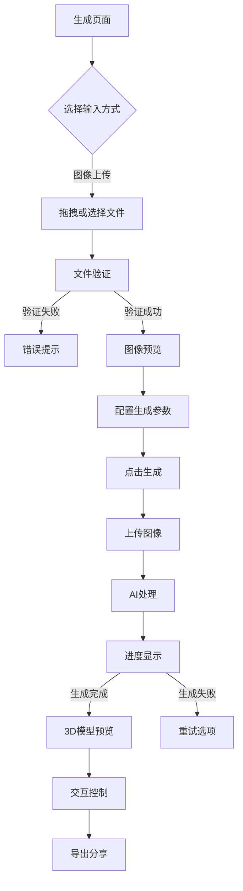
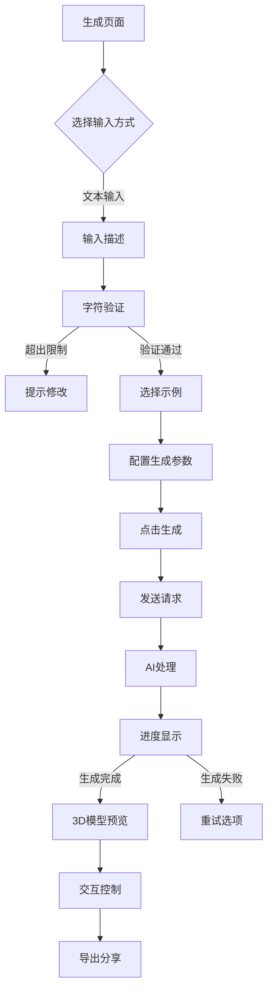
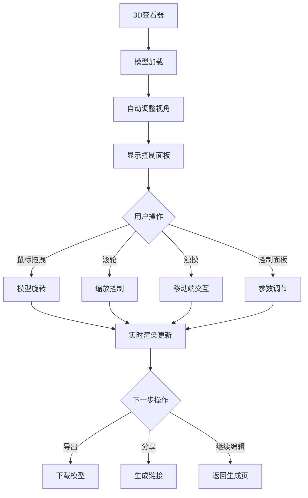

# 3D模型生成Web应用产品需求文档

## 1. 产品概述

开发一个全面的3D模型生成Web应用程序，将图像或文本描述转换为交互式3D模型。该应用基于Next.js框架构建，利用混元AI的3D生成能力，为用户提供简单易用的3D内容创作工具。

**核心价值**：降低3D内容创作门槛，让普通用户也能轻松创建专业级3D模型，满足设计、教育、娱乐等多场景需求。

**目标用户**：设计师、3D爱好者、教育工作者、内容创作者、游戏开发者等需要快速生成3D模型的用户群体。

## 2. 核心功能

### 2.1 用户角色

| 角色 | 注册方式 | 核心权限 |
|------|----------|----------|
| 免费用户 | 邮箱注册/第三方登录 | 每月5次免费生成，基础3D功能 |
| 专业用户 | 付费订阅 | 无限生成，高级功能，优先处理 |
| 企业用户 | 商务合作 | API接入，批量处理，定制服务 |

### 2.2 功能模块

我们的3D模型生成应用包含以下核心页面：

1. **首页**: 产品展示、功能介绍、快速入口
2. **生成页面**: 输入选择、参数配置、实时预览
3. **3D查看器**: 模型展示、交互控制、导出分享
4. **用户中心**: 历史记录、个人设置、订阅管理
5. **帮助中心**: 使用指南、常见问题、技术支持

### 2.3 页面详情

| 页面名称 | 模块名称 | 功能描述 |
|----------|----------|----------|
| 首页 | Hero区域 | 展示产品核心价值，包含3D动态演示和CTA按钮 |
| 首页 | 功能特色 | 轮播展示核心功能：图像生成、文本生成、实时预览 |
| 首页 | 使用流程 | 三步流程图：上传 → 生成 → 预览，支持移动端触摸 |
| 首页 | 用户评价 | 展示真实用户反馈和生成的3D模型案例 |
| 生成页面 | 输入选择 | 标签切换：图像上传/文本输入，支持拖拽和文件选择 |
| 生成页面 | 图像上传 | 支持JPG/PNG/WEBP格式，最大10MB，实时预览和验证 |
| 生成页面 | 文本输入 | 500字符限制，提供示例提示词，实时字符计数 |
| 生成页面 | 参数配置 | 风格选择：写实/卡通/低多边形，质量等级设置 |
| 生成页面 | 生成控制 | 开始生成按钮，进度条显示，预计剩余时间 |
| 生成页面 | 状态反馈 | 实时状态更新：准备中/生成中/完成，错误提示 |
| 3D查看器 | 模型展示 | WebGL渲染，支持GLB/GLTF格式，自动适应屏幕 |
| 3D查看器 | 交互控制 | 鼠标拖拽旋转，滚轮缩放，右键平移，触摸支持 |
| 3D查看器 | 视角预设 | 前/后/左/右/顶/底视图，重置视角，自动旋转 |
| 3D查看器 | 光照调节 | 环境光强度，方向光角度，阴影开关，背景选择 |
| 3D查看器 | 材质预览 | 线框模式，网格显示，材质编辑，纹理替换 |
| 3D查看器 | 导出功能 | 下载GLB文件，生成分享链接，社交媒体分享 |
| 用户中心 | 历史记录 | 网格/列表视图，搜索过滤，批量操作，删除恢复 |
| 用户中心 | 模型详情 | 缩略图预览，创建时间，文件大小，生成参数 |
| 用户中心 | 个人设置 | 头像上传，昵称修改，通知偏好，语言选择 |
| 用户中心 | 订阅管理 | 当前套餐，使用统计，升级续费，支付历史 |
| 帮助中心 | 使用指南 | 分步骤教程，视频演示，交互式引导 |
| 帮助中心 | 常见问题 | 智能搜索，分类浏览，问题反馈，解决方案 |

## 3. 核心流程

### 3.1 图像生成流程

### 3.2 文本生成流程

### 3.3 3D交互流程

## 4. 用户界面设计

### 4.1 设计规范

#### 色彩方案
- **主色调**: #3B82F6 (蓝色) - 代表科技和信任
- **辅助色**: #10B981 (绿色) - 表示成功和完成
- **警告色**: #F59E0B (橙色) - 用于提示和警告
- **错误色**: #EF4444 (红色) - 表示错误和失败
- **中性色**: #6B7280 (灰色) - 文字和边框
- **背景色**: #F9FAFB (浅灰) - 页面背景

#### 字体系统
- **标题**: Inter Bold, 32-48px, 行高1.2
- **正文**: Inter Regular, 16px, 行高1.5
- **小字**: Inter Regular, 14px, 行高1.4
- **按钮**: Inter Medium, 16px, 字母间距0.5px

#### 组件样式
- **按钮**: 圆角8px, 阴影sm, hover状态透明度90%
- **卡片**: 圆角12px, 阴影md, 内边距24px
- **输入框**: 圆角6px, 边框2px, focus状态主色调
- **进度条**: 圆角4px, 动画过渡, 百分比显示

### 4.2 页面布局

#### 响应式断点
- **移动端**: 320px - 767px (单列布局)
- **平板端**: 768px - 1023px (双列布局)
- **桌面端**: 1024px+ (多列布局)

#### 网格系统
- **12列网格**: 最大宽度1280px, 间距24px
- **弹性布局**: Flexbox为主, Grid为辅
- **自适应**: 容器查询支持, 流式布局

### 4.3 交互动效

#### 页面过渡
- **淡入淡出**: 300ms ease-in-out
- **滑动切换**: 400ms cubic-bezier(0.4, 0, 0.2, 1)
- **缩放动画**: 200ms ease-out, 缩放比例0.95-1.0

#### 微交互
- **按钮点击**: 缩放95%, 阴影变化
- **悬停效果**: 透明度变化, 轻微上移
- **加载动画**: 旋转指示器, 脉冲效果
- **成功反馈**: 绿色勾选, 轻微弹跳

### 4.4 页面设计详述

#### 首页设计
- **Hero区域**: 全屏3D动画背景，渐变遮罩，居中文案
- **功能展示**: 卡片式布局，图标+标题+描述，悬停放大
- **流程说明**: 水平时间轴，步骤指示器，数字标记
- **CTA按钮**: 醒目配色，大尺寸，固定底部(移动端)

#### 生成页面设计
- **输入区域**: 拖拽高亮，文件预览，进度指示
- **参数面板**: 折叠式设计，图标化选项，实时预览
- **生成按钮**: 状态变化，加载动画，禁用状态
- **进度显示**: 环形进度条，百分比文字，预计时间

#### 3D查看器设计
- **画布区域**: 全屏显示，工具栏悬浮，透明背景
- **控制面板**: 侧边抽屉，分组显示，图标化控制
- **手势提示**: 首次使用引导，操作说明，快捷手势
- **导出菜单**: 下拉选择，格式说明，分享选项

### 4.5 移动端适配

#### 触摸优化
- **按钮尺寸**: 最小44px, 间距8px
- **手势支持**: 滑动切换，捏合缩放，长按操作
- **键盘适配**: 输入框自动调整，避免遮挡
- **性能优化**: 减少重绘，图片懒加载，代码分割

#### 导航适配
- **汉堡菜单**: 滑动抽屉，层级显示，手势关闭
- **底部导航**: 主要功能入口，状态指示，快速访问
- **返回按钮**: 统一位置，明确标识，手势支持
- **搜索优化**: 顶部固定，自动聚焦，语音输入

## 5. 质量保证

### 5.1 功能测试

#### 输入验证测试
- **文件格式**: JPG、PNG、WEBP格式验证
- **文件大小**: 最大10MB限制测试
- **文本长度**: 500字符限制验证
- **特殊字符**: 表情符号、特殊语言支持

#### 生成功能测试
- **成功率**: 图像生成成功率>95%
- **响应时间**: 平均生成时间<5分钟
- **并发处理**: 支持100个并发请求
- **错误恢复**: 网络中断后自动重试

### 5.2 性能测试

#### 加载性能
- **首屏时间**: <3秒(3G网络)
- **3D模型加载**: <5秒(平均模型大小)
- **交互响应**: <100ms延迟
- **内存使用**: <500MB峰值内存

#### 兼容性测试
- **浏览器**: Chrome 90+, Firefox 88+, Safari 14+, Edge 90+
- **设备**: 桌面端、平板、手机全覆盖
- **分辨率**: 320px-4K屏幕适配
- **网络**: 3G/4G/5G/WiFi环境测试

### 5.3 用户体验测试

#### 可用性测试
- **任务完成率**: >90%用户能独立完成生成
- **操作效率**: 平均完成时间<3分钟
- **错误率**: 用户操作错误率<5%
- **满意度**: 用户满意度评分>4.5/5

#### 可访问性测试
- **屏幕阅读器**: 支持VoiceOver、NVDA
- **键盘导航**: 完整的Tab键导航
- **色彩对比**: WCAG 2.1 AA级标准
- **字体缩放**: 支持200%字体放大

## 6. 项目交付物

### 6.1 代码交付
- **前端代码**: TypeScript源码，模块化结构
- **后端代码**: Node.js服务，RESTful API
- **配置文件**: 环境变量，构建脚本
- **依赖管理**: package.json，lock文件

### 6.2 文档交付
- **技术文档**: 架构设计，API文档
- **用户手册**: 操作指南，常见问题
- **部署指南**: 环境配置，上线流程
- **运维手册**: 监控告警，故障处理

### 6.3 测试交付
- **单元测试**: 核心功能覆盖率>80%
- **集成测试**: API接口测试用例
- **性能测试**: 压力测试报告
- **安全测试**: 漏洞扫描报告

这个PRD文档详细定义了3D模型生成Web应用的功能需求、用户体验和质量标准，为开发团队提供了清晰的实现指导和验收标准。